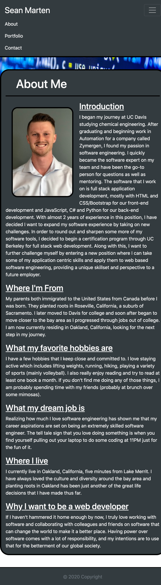
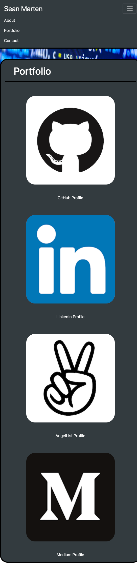
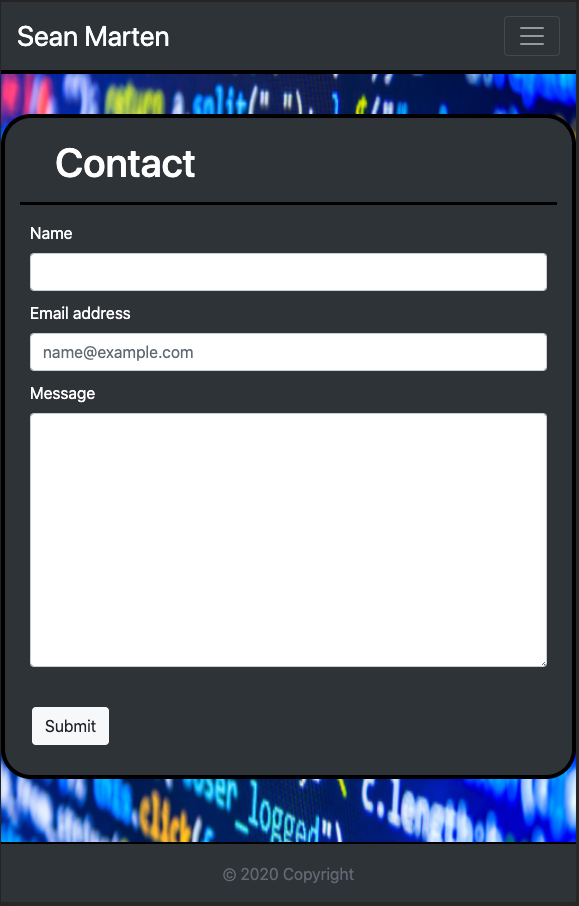
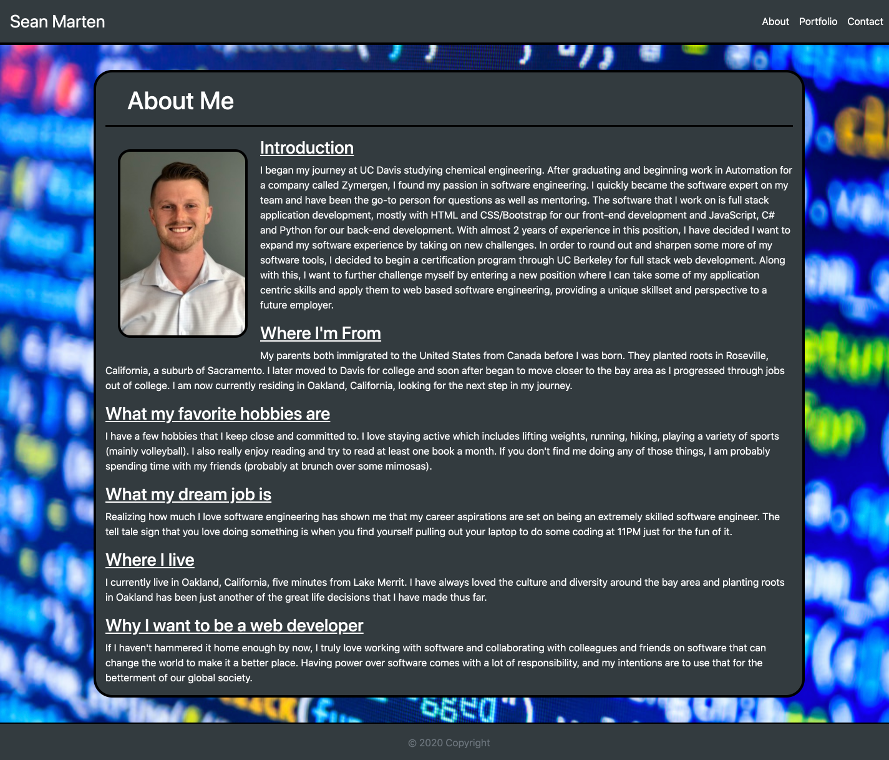
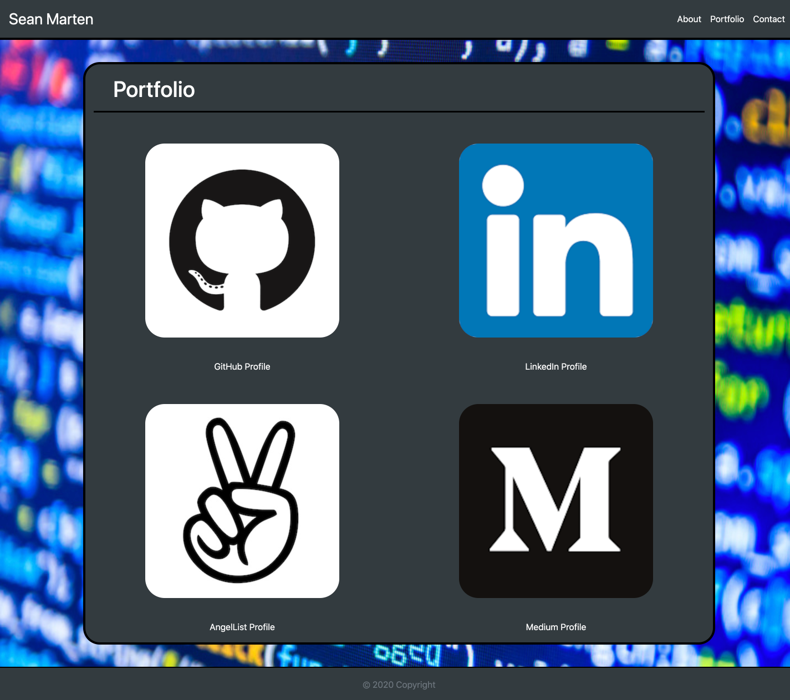
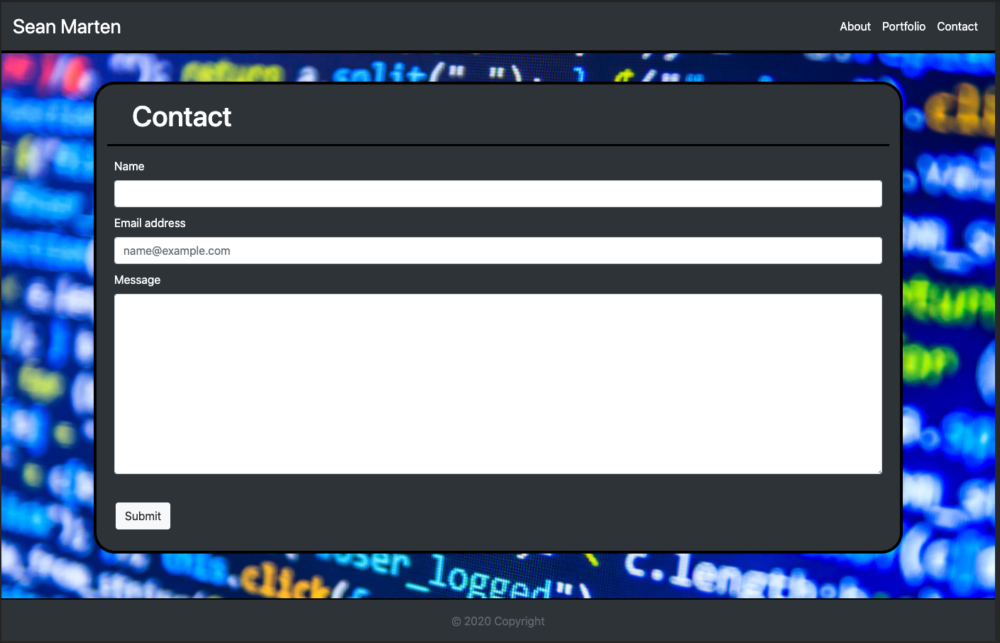

# Responsive Portfolio
This repository contains my professional portfolio. In it you will find a page detailing my biographical summary, a page about my portfolio specific to web development and a page to get in touch with me.

## Outline of Portfolio
This portfolio has many great features, which are outlined below:
1. Three separate web pages containing my biography, portfolio and a contact form, with a navbar that has links to each of these pages. The navbar collapses into a functional burger bar on xs screens.
2. A responsive layout that utilizes vertical margins on screen sizes larger than the extra small category, and no vertical margins on anything falling in the extra small category.
3. Responsive images that resort and resize themselves depending on the screen size.
4. No media queries.
5. Semantic HTML.
6. A sticky footer that only shows when there is enough room on the page, but appears below if the content pushed it down.

## Github links

[Homework-2 Github Repository](https://github.com/sean-marten/sean-marten-portfolio)

[Homework-2 Webpage](https://sean-marten.github.io/sean-marten-portfolio/src/index.html)

## Images of Webpages

Each webpage is equipped with a sticky footer, shown in action below. 

Below are pictures of my webpage at the standard screen sizes according to [Bootstrap](https://getbootstrap.com/docs/4.0/layout/grid/):

### Extra small home page:

### Extra small portfolio page:

### Extra small contact page:

### Greater than extra small home page:

### Greater than extra small portfolio page:

### Greater than extra small contact page:

